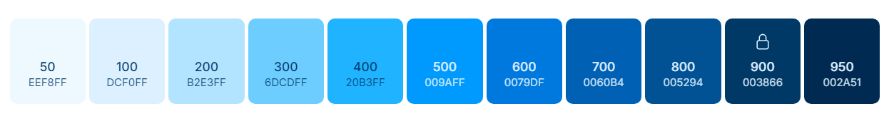

<div align="center">

# Development CepreUNH Web


</div>

## Development Tools

- `Eslint` : Find and fix problems in JavaScript code

  ```text
  └── .eslintrc
  ```

- `Prettier` : Code Formatter (consistent code style)

  ```text
  └── .prettierrc
  └── .prettierignore
  ```

## Tech

- [Astro](https://astro.build/)
- [ViewTransitions](https://docs.astro.build/en/guides/view-transitions/)
- [Tailwind CSS](https://tailwindcss.com/)
- [Animations CSS](https://tailwindcss-animations.vercel.app/)
- [Icons](https://icon-sets.iconify.design/)
- [Sliders](https://swiperjs.com/demos)

## Styles

- Text Color: `#2C2C2C`
- Primary Color: `#ff451c`

  ```css
  :root {
    --primary-color: theme(colors.primary.500);
    --text-color: #2c2c2c;
  }
  ```

- Tailwind Colors UI

  ```js
  primary: {
        50: '#eef8ff',
        100: '#dcf0ff',
        200: '#b2e3ff',
        300: '#6dcdff',
        400: '#20b3ff',
        500: '#009aff',
        600: '#0079df',
        700: '#0060b4',
        800: '#005294',
        900: '#003866',
        950: '#002a51'
        },
  ```

  

## Git Flow

```
[dev-angel, dev-nesk] > dev > main
```

## Commands

Run project:

| Command       | Action                                      |
| :------------ | :------------------------------------------ |
| `npm install` | Installs dependencies                       |
| `npm run dev` | Starts local dev server at `localhost:4321` |
